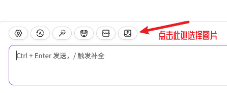

<div align="center">

<h1 align="center">ChatGPT-Midjourney-Business</h1>


一键免费部署你的私人 ChatGPT+Midjourney 商业版网页应用

（基于[ChatGPT-Next-Web](https://github.com/Licoy/ChatGPT-Midjourney.git),[ChatGPT-Midjourney](https://github.com/Licoy/ChatGPT-Midjourney.git)开发）

[//]: # ([QQ交流群]&#40;https://github.com/Licoy/ChatGPT-Midjourney/issues/30&#41; | [赞助项目]&#40;https://licoy.cn/open-sponsor.html&#41; | [PRO版本]&#40;https://github.com/Licoy/ChatGPT-Midjourney-Pro&#41;)

[](https://vercel.com/new/clone?repository-url=https://github.com/1441853031/ChatGpt_Midjourney_Business.git&env=OPENAI_API_KEY&env=MIDJOURNEY_PROXY_URL&env=CODE&project-name=chatgpt-midjourney&repository-name=ChatGPT-Midjourney-Business)

[//]: # ([![Deploy with Railway]&#40;https://img.shields.io/badge/MidjourneyProxy-Railway部署-009900.svg?logo=railway&#41;]&#40;https://github.com/novicezk/midjourney-proxy/blob/main/docs/railway-start.md&#41;)

[//]: # ([![WordPress+ChatGPT支持]&#40;https://img.shields.io/badge/WordPress-ChatGPT%20部署-red.svg?logo=wordpress&logoColor=red&style=for-the-badge&#41;]&#40;https://github.com/Licoy/wordpress-theme-puock&#41;)


## 收益效果


</div>

## 功能支持
- [x] 原`ChatGPT-Next-Web`所有功能
- [x] midjourney `imgine` 想象
- [x] midjourney `upscale` 放大
- [x] midjourney `variation` 变幻
- [x] midjourney `describe` 识图
- [x] midjourney `blend` 混图
- [x] midjourney 垫图
- [x] 绘图进度百分比、实时图像显示
- [x] 授权卡密功能（带到期时间）
- [x] 接入自己的发卡系统（推荐使用异次元发卡网）

## 参数说明
### MIDJOURNEY_PROXY_URL
```shell
MIDJOURNEY_PROXY_URL=http://yourip:port
```
> ⚠️注意：如果你使用的是Docker部署，那么这里的地址应该是`http://公网IP:port`，而不是`http://localhost:port`，因为Docker中的容器是隔离的，`localhost`指向的是容器内部的地址，而不是宿主机的地址。


### MIDJOURNEY_PROXY_API_SECRET
（可选）`midjourney-proxy`的API请求密钥，防止他人恶意调用，可在环境变量中配置。

### CODE
（可选）设置页面中的授权码，防止被其他人轻易使用消耗余额
特别注意：卡密格式（带过期时间，数目无限）+V:awm8u8获取
### 嵌入到自己的发卡
修改代码位置
1./app/locales/cn.ts
```ts
Error: {
    Unauthorized:
        "前往[登录](/#/auth)输入授权码\n 购买地址https://faka.gptsb.cn/",
}
```
2./app/components/sidebar.tsx
```ts
<IconButton
          icon={<AlipayIcon />}
        text={shouldNarrow ? undefined : "获取授权码"}
        className={styles["sidebar-bar-button"]}
        onClick={() => (window.location.href = "https://faka.gptsb.cn/")}
        shadow
        />
```
## 部署
### ChatGPT-Midjourney-Business 前端部署

[//]: # (#### Docker)
```shell
docker run -d -p 3000:3000 \
   -e OPENAI_API_KEY="sk-xxx" \
   -e CODE="123456" \
   -e BASE_URL="https://api.openai.com" \
   -e MIDJOURNEY_PROXY_URL="http://ip:port" \
   1441853031/chatgpt-midjourney-business:v1.0.2
```
#### Vercel
[](https://vercel.com/new/clone?repository-url=https://github.com/1441853031/ChatGpt_Midjourney_Business.git&env=OPENAI_API_KEY&env=MIDJOURNEY_PROXY_URL&env=CODE&project-name=chatgpt-midjourney&repository-name=ChatGPT-Midjourney-Business)


#### 手动部署
- clone本项目到本地
- 安装依赖
```shell
npm install
npm run build
npm run start // #或者开发模式启动： npm run dev
```
### midjourney-proxy 服务部署
#### 
- 运行 `midjourney-proxy` (Midjourney API服务，更多参数配置可以参考：[midjourney-proxy](https://github.com/novicezk/midjourney-proxy))
## 使用
在输入框中以`/mj`开头输入您的绘画描述，即可进行创建绘画，例如：
```
/mj a dog
```
### 混图、识图、垫图

> 提示：垫图模式/识图(describe)模式只会使用第一张图片，混图(blend)模式会按顺序使用选中的两张图片（点击图片可以移除）

## 截图
### 混图、识图、垫图

### 状态实时获取

### 自定义midjourney参数

### 更多功能
- 等你自行发掘

## 鸣谢
- [ChatGPT-Next-Web](https://github.com/Yidadaa/ChatGPT-Next-Web)
- [ChatGPT-Midjourney](https://github.com/Licoy/ChatGPT-Midjourney.git)
- [midjourney-proxy](https://github.com/novicezk/midjourney-proxy)

## 开源协议
[Anti 996 LICENSE](./LICENSE)
